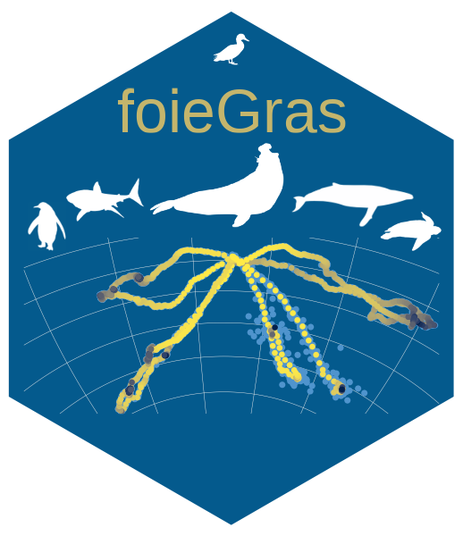
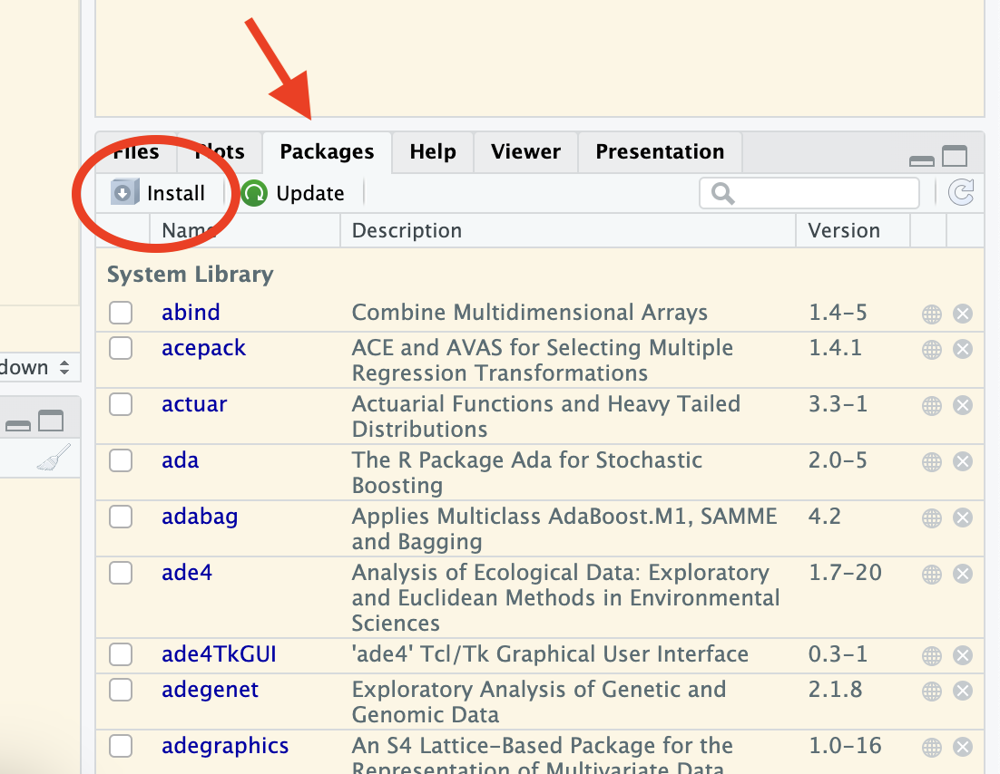
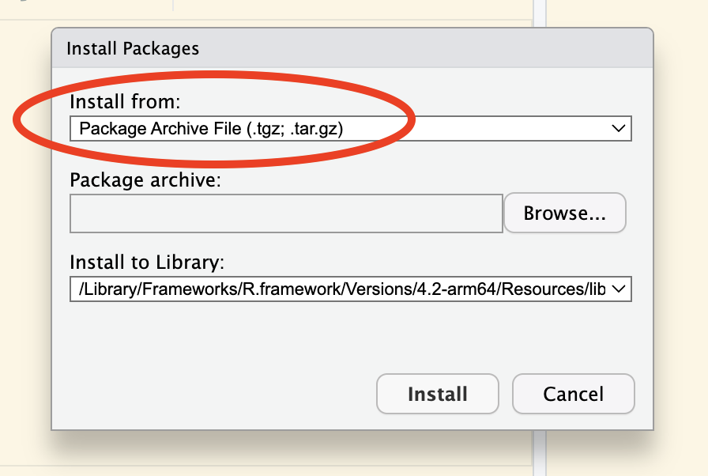

<!-- README.md is generated from README.Rmd. Please edit that file -->

```{r, echo = FALSE}
knitr::opts_chunk$set(
  collapse = TRUE,
  comment = "#>",
  fig.path = "man/figures/README-",
  message = FALSE
)
```


# {aniMotum} <a href='https://ianjonsen.github.io/aniMotum/index.html'></a>

####  fit latent variable movement models to animal tracking data for location quality control and behavioural inference

<!-- badges: start -->
[](https://ianjonsen.r-universe.dev)
[](https://codecov.io/github/ianjonsen/aniMotum?branch=master)
[](https://doi.org/10.5281/zenodo.7425388)
 
<!-- badges: end -->


`{aniMotum}` is an R package that fits continuous-time models in state-space form to filter error-prone animal movement data obtained via the Argos satellite system, and to estimate changes in movement behaviour. Template Model Builder {TMB} is used for fast estimation. Argos data can be either (older) Least Squares-based locations, (newer) Kalman Filter-based locations with error ellipse information, or a mixture of the two. The state-space models estimate two sets of location states: 1) corresponding to each observation, which are usually irregularly timed (fitted states); and 2) corresponding to (usually) regular time intervals specified by the user (predicted states). Locations are returned as both LongLat and on the Mercator projection (units=km). The models may be applied with appropriate caution to tracking data obtained from other systems, such as GPS and light-level geolocations. 

## Installation 
First, ensure you have R version >= 4.0.0 installed (preferably R 4.2.0 or higher):

```{r get-version, eval = FALSE}
R.Version()
```

### From R-Universe
As of `v1.1`, `{aniMotum}` is available via R-Universe. This is where the latest stable version can always be found. If you are on Mac or Windows and are **certain** you have the correct compilation tools and libraries installed (See **From GitHub (source)** below), then installation is:
```{r, eval = FALSE}
# install from my R-universe repository
install.packages("aniMotum", 
                 repos = c("https://cloud.r-project.org",
                 "https://ianjonsen.r-universe.dev"),
                 dependencies = TRUE)

```
This installs all Imported and Suggested R packages from CRAN and R-universe. If queried, answer `Yes` to install the source version. Note, if you haven't installed `{aniMotum}` previously then installation of dependent packages may take a while, especially if many of them need to be compiled. You should only need to go through this once, subsequent installation of `{aniMotum}` updates will be much faster.

To avoid typing the above every time you want to update `{aniMotum}`, you can add my R-Universe repo to your local list of repositories for package download in your `.Rprofile`. This ensures `install.packages` automatically grabs the latest version of `{aniMotum}`
```{r, eval=FALSE}
#install.packages("usethis")
usethis::edit_r_profile()

# add the following text or replace existing repos option
options(repos = c(ianjonsen = 'https://ianjonsen.r-universe.dev',
                  CRAN = 'https://cloud.r-project.org'))
```

### READ THIS CAREFULLY if you are unsure about compiler tools:
If you don't have compiler tools installed, are uncertain if you do, or have trouble getting them to work then you can manually download a binary version of the `{aniMotum}` package for Windows or Mac from here https://ianjonsen.r-universe.dev/aniMotum. There are 3 binary versions for Windows corresponding to a different major release of R, choose the one that matches your R version. You can check your R version by typing `R.Version()` in the R console. There are 4 binary versions for Macs, 2 for Arm 64 Macs (ie. M1 - Mx Macs) and 2 for Intel Macs (x86_64), within these 2 classes there are 2 versions for the latest release version of R and the previous version.

When downloading the binary version on a Mac, it is important to right click and choose "Download Linked File As..." so that the file isn't automatically uncompressed. If you have downloaded the file correctly, its extension will be `.tgz`, **not** `.tar`. You can use the following command in the R console to install the file you've just downloaded (where `path_to_file` is wherever you saved the download):
```{r, eval=FALSE}
# for Windows
install.packages("path_to_file\aniMotum_1.2-06.zip", 
                 repos=NULL, type="win.binary", dependencies = TRUE)

# for Mac
install.packages("path_to_file/aniMotum_1.2-06.tgz", 
                 repos=NULL, type="mac.binary", dependencies = TRUE)

```

Alternatively, in RStudio, you can use the GUI by clicking the Packages tab and then the Install button:

{#id .class width=50% height=50%}

This will open an install box, where you want to select "Package Archive File (.tgz, .tar.gz)" option under "Install from:". On a Mac, this looks like the following (Windows will be similar):

{#id .class width=50% height=50%}

Then, click the "Browse" button to navigate to wherever you saved the `.zip` (Windows) or `.tgz` (Mac) binary file and click "Install".

{#id .class width=50% height=50%}

### From GitHub (source)  
If you prefer installing from GitHub via `remotes::install_github()` and know your way around the installation of compilers and associated libraries, then you will need to ensure you have the proper compilation tools and libraries installed. 

On PC's running Windows, ensure you have installed [Rtools](https://cran.r-project.org/bin/windows/Rtools/). 

On Mac's, ensure you have installed the Command Line Tools for Xcode by executing `xcode-select --install` in the terminal; or you can download the latest version from the URL (free developer registration may be required). A full Xcode install uses up a lot of disk space and is not required. Also, ensure you have a suitable Gnu Fortran compiler installed. The easiest install option is to download a compiled version from here  https://github.com/fxcoudert/gfortran-for-macOS/releases. Just make sure you choose the version that matches your MacOS and processor (Intel vs Arm 64). 
```{r gh-installation_staging, eval = FALSE}
remotes::install_github("ianjonsen/aniMotum")
```

Note: there can be issues getting compilers to work properly. Often, this is due to missing or incorrect Xcode Command Line Tools and/or Fortran compiler. If you encounter install and compile issues, you may find a solution in the excellent documentation here [glmmTMB](https://github.com/glmmTMB/glmmTMB). 

If you don't have the time & patience for sorting out compiler/library issues then just install the appropriate binary version. `aniMotum` models may not fit quite as fast as they could on your setup, but they will still be fast. We're talking about differences of milliseconds to a few seconds per animal track, so you decide where your time is best spent!

## Usage
`{aniMotum}` is intended to be as easy to use as possible. Here's a simple example showing how to fit a move persistence state-space model to Argos tracking data and visualise the result:
```{r example1, eval=FALSE, message=FALSE, fig.dim=c(9,4), out.width="100%"}
library(aniMotum)

fit <- fit_ssm(sese, 
               vmax= 4, 
               model = "mp", 
               time.step = 24, 
               control = ssm_control(verbose = 0))

plot(fit, type = 3, pages = 1, ncol = 2)
```

```{r ex1, echo=FALSE, message=FALSE, fig.dim=c(9,4), out.width="100%"}
library(aniMotum)
load("misc/fit.rda")
plot(fit, type = 3, pages = 1, ncol = 2, pal = "Plasma")
```


```{r example2, eval=FALSE, message=FALSE}
map(fit, 
    what = "predicted", 
    crs = "+proj=stere +lon_0=68 +units=km +datum=WGS84")
```

```{r explots2, echo=FALSE, message=FALSE, fig.dim=c(9,5), out.width="100%"}
m <- map(fit, 
         what = "predicted", 
         crs = "+proj=stere +lon_0=68 +units=km +datum=WGS84",
         silent = TRUE)

require(cowplot)
## using cowplot to add southern elephant seal silhouettes to map
ggdraw() +
  draw_plot(m) +
  draw_image("inst/logo/img/sese_female_orig.png",  x=0.172, y=0.87, scale=0.175, hjust=0.5, vjust=0.5) +
  draw_image("inst/logo/img/sese_male_orig.png",  x=0.85, y=0.35, scale=0.25, hjust=0.5, vjust=0.5)
```

Southern elephant seal silhouettes kindly provided by:  
- female southern elephant seal, Sophia Volzke ([@SophiaVolzke](https://twitter.com/SophiaVolzke), University of Tasmania)  
- male southern elephant seal, Anton Van de Putte ([@AntonArctica](https://twitter.com/Antonarctica), Université Libre de Bruxelles)  

## What to do if you encounter a problem
If you are convinced you have encountered a bug or unexpected/inconsistent behaviour when using `{aniMotum}`, you can post an issue [here](https://github.com/ianjonsen/aniMotum/issues). First, have a read through the posted issues to see if others have encountered the same problem and whether a solution has been offered. You can reply to an existing issue if you have the same problem and have more details to share or you can submit a new issue. To submit an issue, you will need to _clearly_ describe the unexpected behaviour, include a reproducible example with a small dataset, clearly describe what you expected to happen (but didn't), and (ideally) post a few screenshots/images that nicely illustrate the problem.

## How to Contribute
Contributions from anyone in the Movement Ecology/Bio-Logging communities are welcome. Consider submitting a feature request [here](https://github.com/ianjonsen/aniMotum/issues/new/choose) to start a discussion. Alternatively, if your idea is well-developed then you can submit a pull request for evaluation [here](https://github.com/ianjonsen/aniMotum/pulls). Unsure about what all this means but still want to discuss your idea? then have a look through the GitHub pages of community-built R packages like [tidyverse/dplyr](https://github.com/tidyverse/dplyr) for examples.

## Code of Conduct
Please note that the aniMotum project is released with a [Contributor Code of Conduct](https://contributor-covenant.org/version/2/0/CODE_OF_CONDUCT.html). By contributing to this project, you agree to abide by its terms.

## Acknowledgements  
Development of this R package was funded by a consortium of partners including:  
- **Macquarie University**  
- **US Office of Naval Research** (ONR Marine Mammal Biology;grant N00014-18-1-2405)  
- Australia's **Integrated Marine Observing System** (IMOS)  
- Canada's **Ocean Tracking Network** (OTN)  
- **Taronga Conservation Society**  
- **Birds Canada**  
- **Innovasea/Vemco**  
Additional support was provided by France's Centre de Synthèse et d'Analyse sur la Biodiversite, part of the Fondation pour la 
Recherche sur la Biodiversité.  

Example southern elephant seal data included in the package were sourced from 
the IMOS Animal Tracking Facility. IMOS is a national collaborative research infrastructure, supported by the Australian Government and operated by a 
consortium of institutions as an unincorporated joint venture, with the 
University of Tasmania as Lead Agent. IMOS supported elephant seal fieldwork on 
Iles Kerguelen conducted as part of the IPEV program No 109 (PI H. Weimerskirch)
and the SNO-MEMO program (PI C. Guinet). SMRU SRDL-CTD tags were partly funded by
CNES-TOSCA and IMOS. All tagging procedures were approved and executed under 
University of Tasmania Animal Ethics Committee guidelines.  

Animal silhouettes used in the `aniMotum` logo were obtained and modified from 
sources:  
- southern elephant seal, Anton Van de Putte ([@AntonArctica](https://twitter.com/Antonarctica), Université Libre de Bruxelles)  
- humpback whale, Chris Huh via [Phylopic.org](http://phylopic.org) Creative Commons Attribution-ShareAlike 3.0 Unported  
- mallard duck, Maija Karala via [Phylopic.org](http://phylopic.org) Creative Commons Attribution-ShareAlike 3.0 Unported  
- leatherback turtle, James R. Spotila & Ray Chatterji via [Phylopic.org](http://phylopic.org) Public Domain Dedication 1.0  
- white shark, Margo Michaud via [Phylopic.org](http://phylopic.org) Public Domain Dedication 1.0  
- king penguin, Steven Traver via [Phylopic.org](http://phylopic.org) Public Domain Dedication 1.0