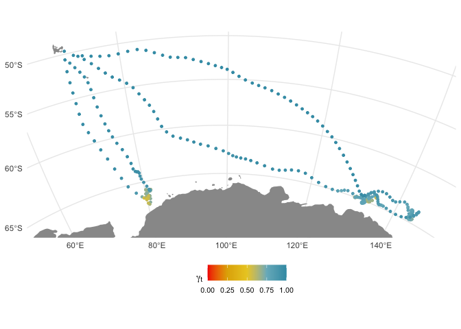

<!-- README.md is generated from README.Rmd. Please edit that file -->

**foieGras** - fit latent variable movement models to animal tracking
data for location quality control and behavioural inference

<!-- badges: start -->

[](https://www.tidyverse.org/lifecycle/#maturing)
[](https://www.repostatus.org/#active)
[](https://codecov.io/github/ianjonsen/foieGras?branch=master)
[](https://cran.r-project.org/package=foieGras)
[](http://www.r-pkg.org/pkg/foieGras)
[](http://r-pkg.org/pkg/foieGras)
[](https://doi.org/10.5281/zenodo.2628481)

master branch:  
[](https://travis-ci.org/ianjonsen/foieGras)

dev branch:  
[](https://travis-ci.org/ianjonsen/foieGras)
<!-- badges: end -->

`foieGras` is an R package that fits a continuous-time model (RW or CRW)
in state-space form to filter Argos (or GLS) satellite location data.
Template Model Builder (`TMB`) is used for fast estimation. Argos data
can be either (older) Least Squares-based locations, (newer) Kalman
Filter-based locations with error ellipse information, or a mixture of
the two. The state-space model estimates two sets of location states: 1)
corresponding to each observation, which are usually irregularly timed
(fitted states); and 2) corresponding to (usually) regular time
intervals specified by the user (predicted states). Locations are
returned as both LongLat and on the Mercator projection (units=km).
Additional models are provided to infer movement behaviour along the
SSM-estimated most-probable track.

## Installation

First, ensure you have R version \>= 3.6.0 installed (preferably R 4.0.0
or higher):

``` r
R.Version()
```

### From CRAN

`foieGras` is on [CRAN](https://cran.r-project.org/package=foieGras) and
can be downloaded within `R`, e.g., `install.packages("foieGras")` or,
more completely: `install.packages("foieGras", depedencies =
c("Imports","LinkingTo","Suggests"))`

### From GitHub (source)

On PC’s running Windows, ensure you have installed
[Rtools](https://cran.r-project.org/bin/windows/Rtools/)

On Mac’s, ensure you have installed
[Xcode](https://developer.apple.com/xcode/) and Xcode developer tools.
If installation is needed, make sure you start Xcode after install to
ensure final setup of developer tools is completed. Both Xcode and Xcode
developer tools can be installed from the [Mac App
Store](https://itunes.apple.com/au/app/xcode/id497799835?mt=12)

To get the very latest `foieGras` stable version, you can install from
GitHub:

``` r
remotes::install_github("ianjonsen/foieGras")
```

Note: there can be issues getting compilers to work properly, especially
on a Mac with OS X 10.13.x or higher. If you encounter install and
compile issues, I recommend you consult the excellent information on the
[glmmTMB](https://github.com/glmmTMB/glmmTMB) GitHub.

## Basic example

`foieGras` is intended to be as easy to use as possible. Here’s an
example showing how to quality control Argos tracking data and infer a
behavioural index along animal tracks:

``` r
library(tidyverse)
library(foieGras)

ellies
#> # A tibble: 288 x 5
#>    id        date                lc      lon   lat
#>    <chr>     <dttm>              <fct> <dbl> <dbl>
#>  1 ct36-F-09 2009-02-10 19:42:44 A      70.6 -49.7
#>  2 ct36-F-09 2009-02-11 07:56:36 A      70.2 -50.2
#>  3 ct36-F-09 2009-02-12 01:53:07 A      70.1 -51.1
#>  4 ct36-F-09 2009-02-12 19:06:55 B      69.5 -52.0
#>  5 ct36-F-09 2009-02-13 12:13:19 B      71.0 -53.1
#>  6 ct36-F-09 2009-02-14 01:10:58 B      70.1 -53.4
#>  7 ct36-F-09 2009-02-14 20:47:58 B      70.3 -54.3
#>  8 ct36-F-09 2009-02-15 15:32:13 A      70.3 -55.4
#>  9 ct36-F-09 2009-02-16 05:28:22 B      70.9 -55.9
#> 10 ct36-F-09 2009-02-16 20:29:14 B      70.9 -56.7
#> # … with 278 more rows

fit <- fit_ssm(ellies, vmax = 4, model = "crw", time.step = 24, verbose = 0)
plot(fit, what = "predicted")
```

<!-- -->

``` r

fmp <- fit %>% 
  grab(what = "predicted", as_sf = FALSE) %>%
  select(id, date, lon, lat) %>%
  fit_mpm(model = "jmpm")
#> fitting jmpm...
#>  pars:   0 0 0       pars:   -10 -10 -7.79336       pars:   -3.14421 -3.14421 -2.45039       pars:   -1.45489 -1.45489 -1.13385       pars:   -3.57693 -7.50806 -4.16447       pars:   -2.0877 -3.25999 -2.0376       pars:   -1.72535 -2.22639 -1.52011       pars:   -1.8028 -2.60053 -1.61483       pars:   -1.75945 -2.3911 -1.56181       pars:   -1.83198 -2.38463 -1.5485       pars:   -1.80865 -2.39362 -1.51063       pars:   -1.78037 -2.40869 -1.35048       pars:   -1.75358 -2.43276 -0.89015       pars:   -1.77783 -2.43105 -0.59397       pars:   -1.83038 -2.38511 -0.60967       pars:   -1.85163 -2.4075 -0.62148       pars:   -1.85259 -2.41005 -0.61647       pars:   -1.85288 -2.41006 -0.61389       pars:   -1.85304 -2.40998 -0.61217       pars:   -1.85305 -2.40998 -0.61209

plot(fmp)
```

<!-- -->

``` r

fmap(fit, fmp, what = "predicted", crs = "+proj=stere +lon_0=99 +units=km +ellps=WGS84")
```

<!-- -->
