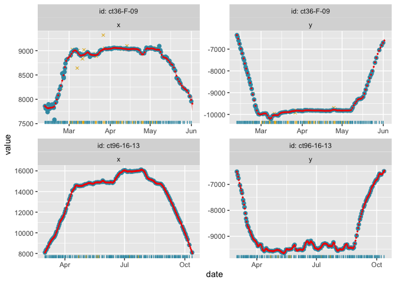
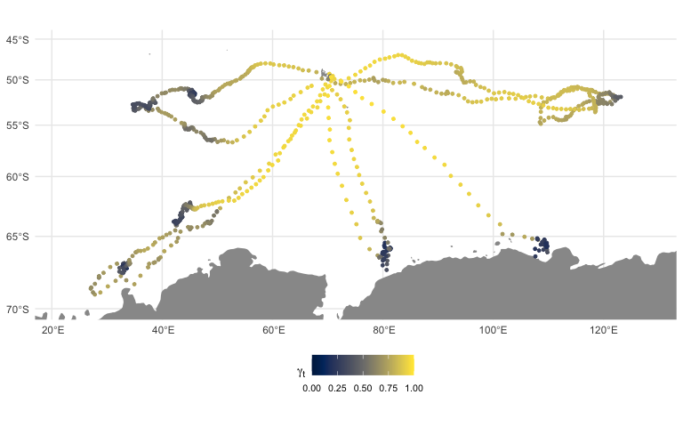

<!-- README.md is generated from README.Rmd. Please edit that file -->

**foieGras** - fit latent variable movement models to animal tracking
data for location quality control and behavioural inference

<!-- badges: start -->

[](https://lifecycle.r-lib.org/articles/stages.html)
[](https://www.repostatus.org/#active)
[](https://codecov.io/github/ianjonsen/foieGras?branch=master)
[](https://cran.r-project.org/package=foieGras/)
[](https://www.r-pkg.org/pkg/foieGras)
[](https://cran.r-project.org/package=foieGras/)
[](https://doi.org/10.5281/zenodo.2628481)

master branch:  


dev branch:  

<!-- badges: end -->

`foieGras` is an R package that fits a continuous-time model (RW or CRW)
in state-space form to filter Argos (or GLS) satellite location data.
Template Model Builder (`TMB`) is used for fast estimation. Argos data
can be either (older) Least Squares-based locations, (newer) Kalman
Filter-based locations with error ellipse information, or a mixture of
the two. The state-space model estimates two sets of location states: 1)
corresponding to each observation, which are usually irregularly timed
(fitted states); and 2) corresponding to (usually) regular time
intervals specified by the user (predicted states). Locations are
returned as both LongLat and on the Mercator projection (units=km).
Additional models are provided to infer movement behaviour along the
SSM-estimated most-probable track.

## Installation

First, ensure you have R version \>= 3.6.0 installed (preferably R 4.0.0
or higher):

``` r
R.Version()
```

### From CRAN

`foieGras` is on [CRAN](https://cran.r-project.org/package=foieGras/)
and can be downloaded within `R`, in the usual way
`install.packages("foieGras")` or, more completely:
`install.packages("foieGras", depedencies =
c("Imports","LinkingTo","Suggests"))`

### From GitHub (source)

On PC’s running Windows, ensure you have installed
[Rtools](https://cran.r-project.org/bin/windows/Rtools/)

On Mac’s, ensure you have installed the [Command Line Tools for
Xcode](https://developer.apple.com/download/more/) by executing
`xcode-select --install` in the terminal; or you can download the latest
version from the URL (free developer registration may be required). A
full Xcode install uses up a lot of disk space and is not required.

To get the very latest `foieGras` stable version, you can install from
GitHub:

``` r
remotes::install_github("ianjonsen/foieGras")
```

Note: there can be issues getting compilers to work properly, especially
on a Mac with OS X 10.13.x or higher. If you encounter install and
compile issues, I recommend you consult the excellent information on the
[glmmTMB](https://github.com/glmmTMB/glmmTMB) GitHub.

## Basic example

`foieGras` is intended to be as easy to use as possible. Here’s an
example showing how to quality-control Argos tracking data, and infer a
behavioural index along the estimated animal tracks:

``` r
library(tidyverse)
library(foieGras)

fit <- fit_ssm(sese, vmax= 4, model = "crw", time.step = 24, control = ssm_control(verbose = 0, se = FALSE))

fmp <- fit_mpm(fit, what = "predicted", model = "jmpm", control = mpm_control(verbose = 0))

plot(fmp, pages = 1, ncol = 3, pal = "Zissou1", rev = TRUE)
```

<!-- -->

``` r

fmap(fit, fmp, what = "predicted", pal = "Cividis")
```

<!-- -->

## What to do if you encounter a problem

If you are convinced you have encountered a bug or
unexpected/inconsistent behaviour when using foieGras, you can post an
issue [here](https://github.com/ianjonsen/foieGras/issues). First, have
a read through the posted issues to see if others have encountered the
same problem and whether a solution has been offered. You can reply to
an existing issue if you have the same problem and have more details to
share or you can submit a new issue. To submit an issue, you will need
to *clearly* describe the unexpected behaviour, include a reproducible
example with a small dataset, clearly describe what you expected to
happen (but didn’t), and (ideally) post a few screenshots/images that
nicely illustrate the problem.

## How to Contribute

Contributions from anyone in the Movement Ecology/Bio-Logging
communities are welcome. Consider submitting a feature request
[here](https://github.com/ianjonsen/foieGras/issues/new/choose) to start
a discussion. Alternatively, if your idea is well-developed then you can
submit a pull request for evaluation
[here](https://github.com/ianjonsen/foieGras/pulls). Unsure about what
all this means but still want to discuss your idea? then have a look
through the GitHub pages of community-built R packages like
[tidyverse/dplyr](https://github.com/tidyverse/dplyr) for examples.

## Code of Conduct

Please note that the foieGras project is released with a [Contributor
Code of
Conduct](https://contributor-covenant.org/version/2/0/CODE_OF_CONDUCT.html).
By contributing to this project, you agree to abide by its terms.
