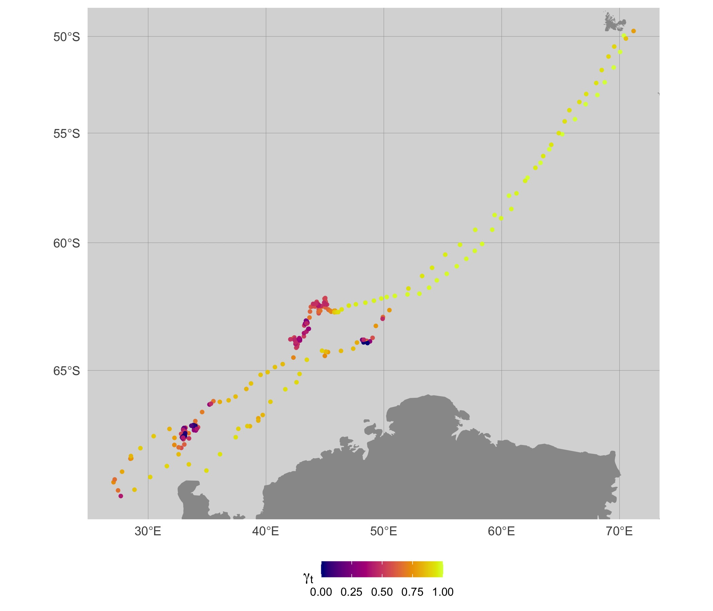

```{r, include = FALSE}
knitr::opts_chunk$set(
  collapse = TRUE,
  comment = "#>"
)
require(foieGras)
require(ggplot2)
```
`foieGras` provides a few different ways to fit a move persistence model to obtain estimates of a continuous-valued behavioural index along individual tracks (Auger-Méthé et al. 2017; Jonsen et al. 2019). In `foieGras` versions prior to 1.0-5, move persistence was estimated via `fit_mpm()` and, when fitting to Argos or other location error-prone data types, required a two-stage approach of first calling `fit_ssm()` and then calling `fit_mpm()`. The first step fits a state-space model to account for location error in the data:
```{r fit ssm, warning=FALSE, message=FALSE}
d <- subset(sese, id == "ct109-186-14")
fit <- fit_ssm(d, 
               vmax = 3,
               model = "crw", 
               time.step = 24,
               control = ssm_control(verbose = 0))
```

The second step estimates move persistence from the SSM-estimated locations:
```{r fit mpm, warning=FALSE, message=FALSE}
fmp <- fit_mpm(fit, 
               what = "predicted", 
               model = "mpm",
               control = mpm_control(verbose = 0))
```

Using this approach, location uncertainty is not carried through to the estimation of move persistence. This can potentially result in estimates of move persistence that are biased. 
```{r ts1, eval=FALSE, warning=FALSE, message=FALSE}
plot(fmp, ask = FALSE)
```
{width=95%}


```{r map1, eval=FALSE, fig.width=7, fig.height=6}
map(fit, fmp, what = "predicted", silent = TRUE)
```
{width=95%}

`foieGras` now provides a move persistence model in state-space form to allow simultaneous estimation of move persistence and location states, and this is invoked via `fit_ssm()` by specifying `model = "mp"`. Currently, this model can only be fit to individuals separately.

Here, we fit the move persistence SSM to the same southern elephant seal track as above:
```{r fit_ssm, warning=FALSE, message=FALSE}
fit <- fit_ssm(d, 
               vmax = 3, 
               model = "mp", 
               time.step = 24,
               control = ssm_control(verbose = 0))
```

Move persistence estimates can be plotted as a time-series. Note the broadly similar time-series of move persistence estimates as above, but here considerably more variability is apparent because we have not smoothed away that variability by fitting to SSM-smoothed location estimates as in the above example.
```{r ts2, eval=FALSE, fig.width=7, fig.height=3}
plot(fit, what = "predicted", type = 3, normalise = TRUE)
```
{width=95%}

Here, `plot()` extracts move persistence estimates as either fitted (corresponding to observation times) or predicted (corresponding to regular time intervals) values using `grab()` internally. The `normalise` argument rescales the estimates to span the interval 0,1. Move persistence estimates from `fit_ssm()` tend to be smoothed more extremely compared those obtained from `fit_mpm()` and can lack contrast. Normalising the estimates provides a clearer view of changes in movement behaviour along tracks, highlighting regions where animals spend disproportionately more or less time. When fitting to a collection of individuals, the normalisation can be applied separately to each individual or collectively via `normalise = TRUE, group = TRUE`. In the latter case, the relative magnitudes of move persistence are preserved across individuals.

When mapping these move persistence estimates along the 2-D track, we can see that segments of low (dark blue) and high (bright yellow) move persistence correspond to areas where the seal spends disproportionately more or less time, respectively. The pattern is overall quite similar to the map using `fit_mpm` estimates, but there are subtle differences apparent.
```{r map2, eval=FALSE, fig.width=7, fig.height=6}
map(fit, what = "p", normalise = TRUE, silent = TRUE)
```
{width=95%}