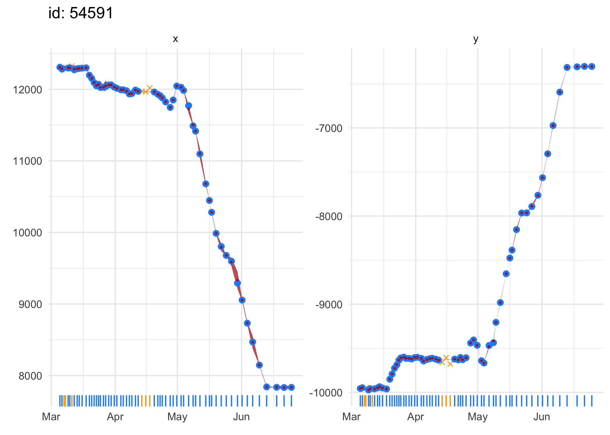
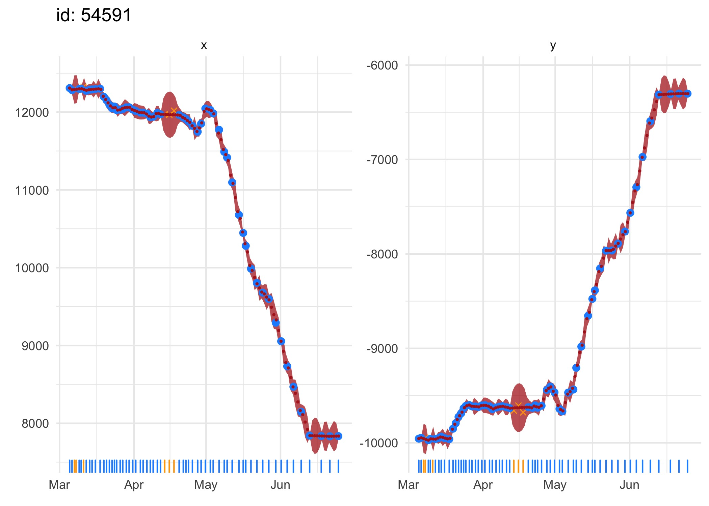
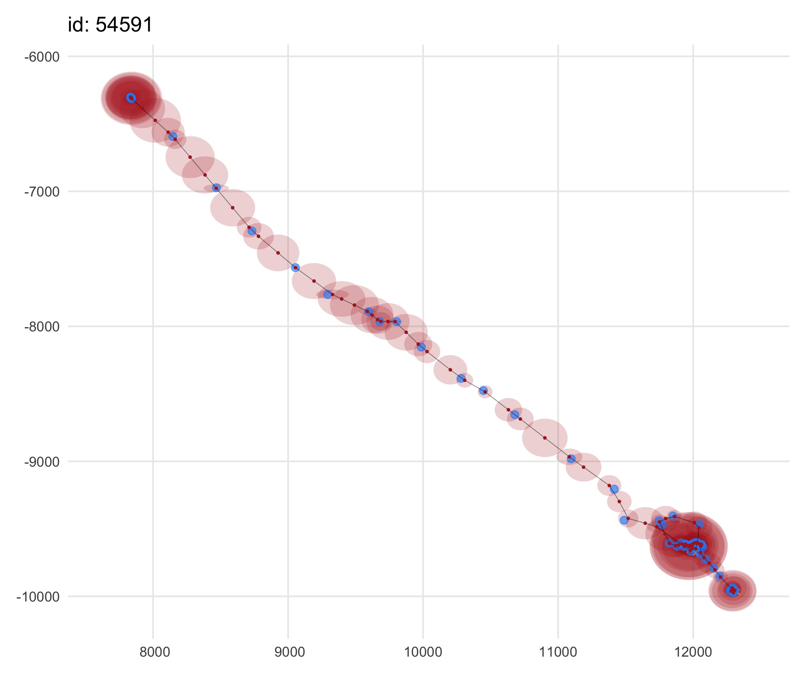
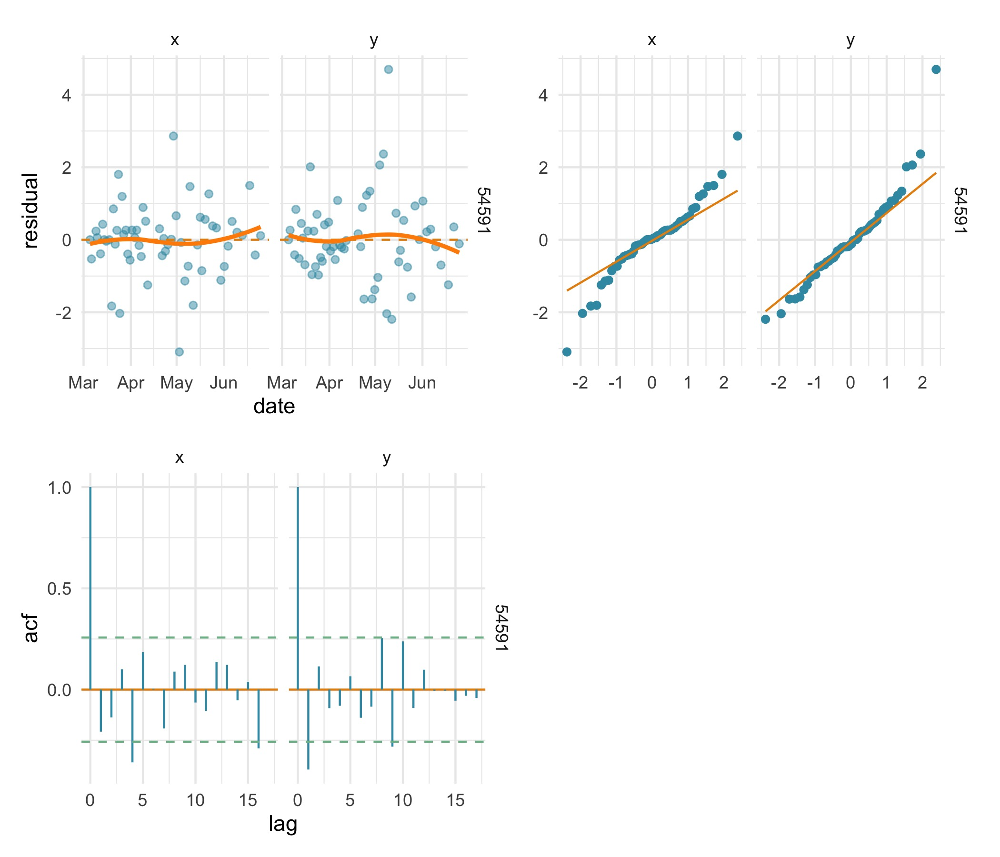

```{r, include = FALSE}
knitr::opts_chunk$set(
  collapse = TRUE,
  comment = "#>"
)
require(foieGras)
```

Just like any other statistical model fitting exercise, validating SSM fits to tracking data is an essential part of any analysis. SSM fits can be visualized quickly using the generic `plot` function on model fit objects:

```{r visualise SSM fit1, eval=FALSE, fig.width=7, fig.height=5}
fit.rw <- fit_ssm(ellie, 
                  model = "rw", 
                  time.step = 24, 
                  control = ssm_control(verbose = 0))

plot(fit.rw, what = "fitted")

plot(fit.rw, what = "predicted")
```
```{r visualise SSM fit2, echo=FALSE, fig.width=7, fig.height=5}
fit.rw <- fit_ssm(ellie, 
                  model = "rw", 
                  time.step = 24, 
                  control = ssm_control(verbose = 0))
```
{width=95%}
{width=95%}


Both fitted and predicted locations (red) can be plotted as 1-D time-series on top of the observations (blue) to visually detect any lack of fit. Observations that failed to pass the `prefilter` stage prior to SSM fitting (orange x's) can be included (default) or omitted with the `outlier` argument. A rug plot along the x-axis aids detection of data gaps in the time-series. Note, in second plot, the larger standard errors for predicted locations through small data gaps.

The SSM fits can also be visualised as 2-D tracks via the `type` argument:
```{r visualise as track, eval=FALSE, fig.width=7, fig.height=6}
plot(fit.rw, "p", type = 2)
```
{width=95%}


This option can provides an intuitive view of the estimated track (red) through the observations (blue), along with a 2-dimensional representation of the location uncertainty (red ellipses). 

Residual plots are important for validating models, but classical Pearson residuals, for example, are not appropriate for state-space models. Instead, a one-step-ahead prediction residual, provides a useful if computationally demanding alternative. In `foieGras`, prediction residuals from state-space model fits are calculated using the `osar` function and can be visualized as time-series plots, Q-Q plots, or autocorrelation functions:
```{r osar plots1, eval=FALSE, warning=FALSE, message=FALSE, fig.width=7, fig.height=6}
# use patchwork package to arrange plot.osar options
require(patchwork)
# calculate & plot residuals
res.rw <- osar(fit.rw)

(plot(res.rw, type = "ts") | plot(res.rw, type = "qq")) / 
  (plot(res.rw, type = "acf") | plot_spacer())
```
```{r osar plots2, echo=FALSE, warning=FALSE, message=FALSE, fig.width=7, fig.height=6}
res.rw <- osar(fit.rw)
```
{width=95%}

Here, the 3 residual plots highlight a poor fit of the `rw` SSM to the x-coordinate. The time-series residual plot implies a bias in the `rw` SSM fit over the latter half of the track, the Q-Q plot highlights a distinct departure from normality in the x residuals, and the x residuals are positively autocorrelated.

Fitting the `crw` SSM to the same data, we can see the prediction residual plots imply a less biased fit with approximately normal residuals that have little autocorrelation in both coordinates. Additionally, the `crw` model fit has a lower AIC~c~ than the `rw`. Although note that AIC statistics can be misleading for time-series models and should not be used as the sole criterion for preferring one model fit over another. Here, at least, the AIC~c~ values are in agreement with the prediction residual diagnostics.
```{r fit crw and plot osar1, eval=FALSE, warning=FALSE, message=FALSE, fig.width=7, fig.height=6}
fit.crw <- fit_ssm(ellie, 
                   model = "crw", 
                   time.step = 24, 
                   control = ssm_control(verbose = 0))

res.crw <- osar(fit.crw)

(plot(res.crw, type = "ts") | plot(res.crw, type = "qq")) / 
  (plot(res.crw, type = "acf") | plot_spacer())

c(fit.rw$ssm[[1]]$AICc, fit.crw$ssm[[1]]$AICc)
```
```{r fit crw and plot osar2, echo=FALSE, warning=FALSE, message=FALSE, fig.width=7, fig.height=6}
fit.crw <- fit_ssm(ellie, 
                   model = "crw", 
                   time.step = 24, 
                   control = ssm_control(verbose = 0))

res.crw <- osar(fit.crw)
```
```{r fit crw and plot osar3, echo=FALSE}
c(fit.rw$ssm[[1]]$AICc, fit.crw$ssm[[1]]$AICc)
```
{width=95%}


As calculation of prediction residuals can be computationally demanding, typically requiring more time than fitting the model, especially for multiple individual tracks, the `osar` function is automatically implemented in parallel when calculating residuals for more than 2 tracks. 