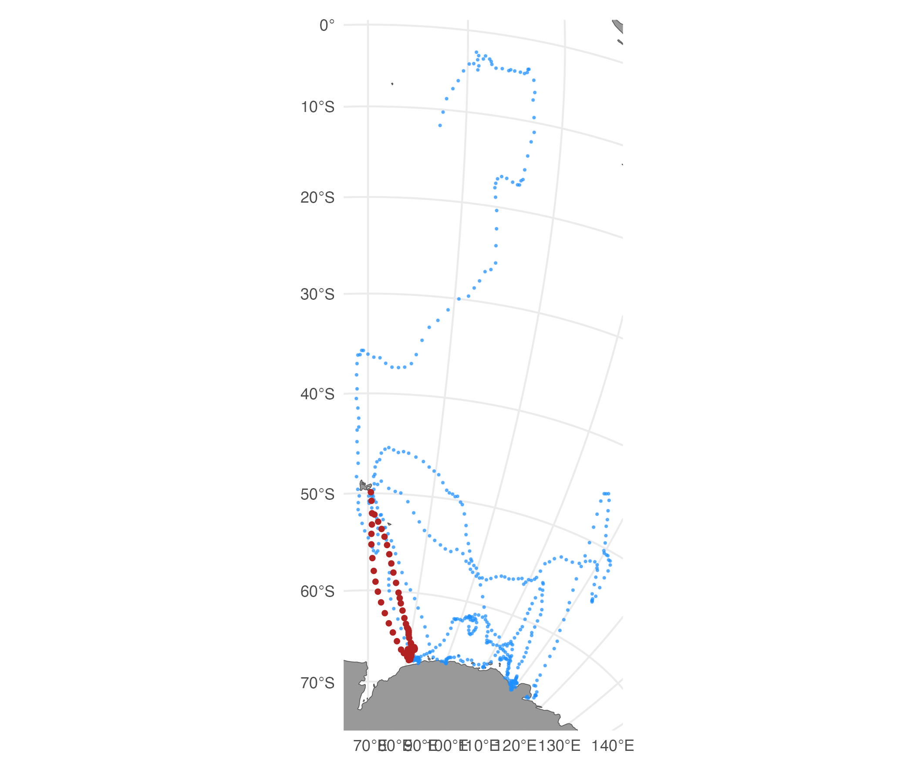
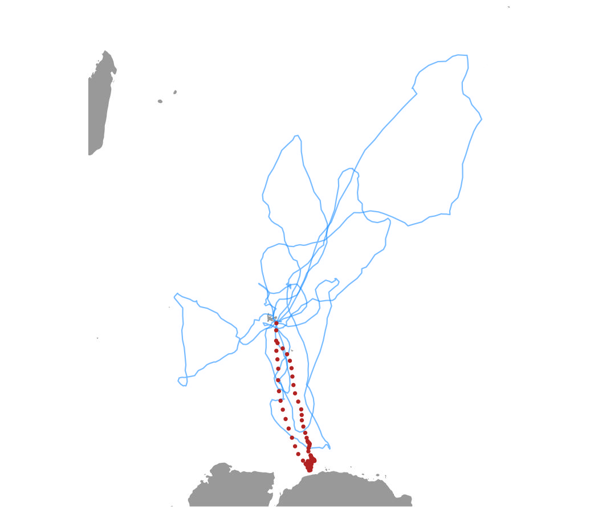
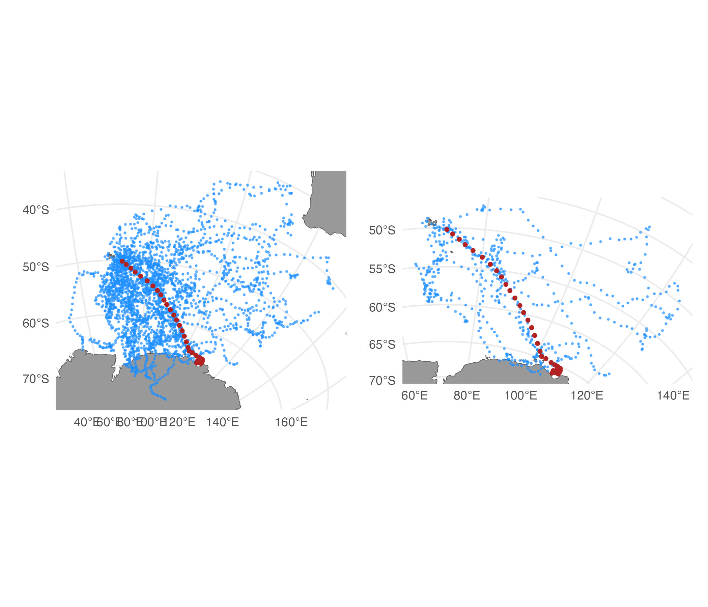
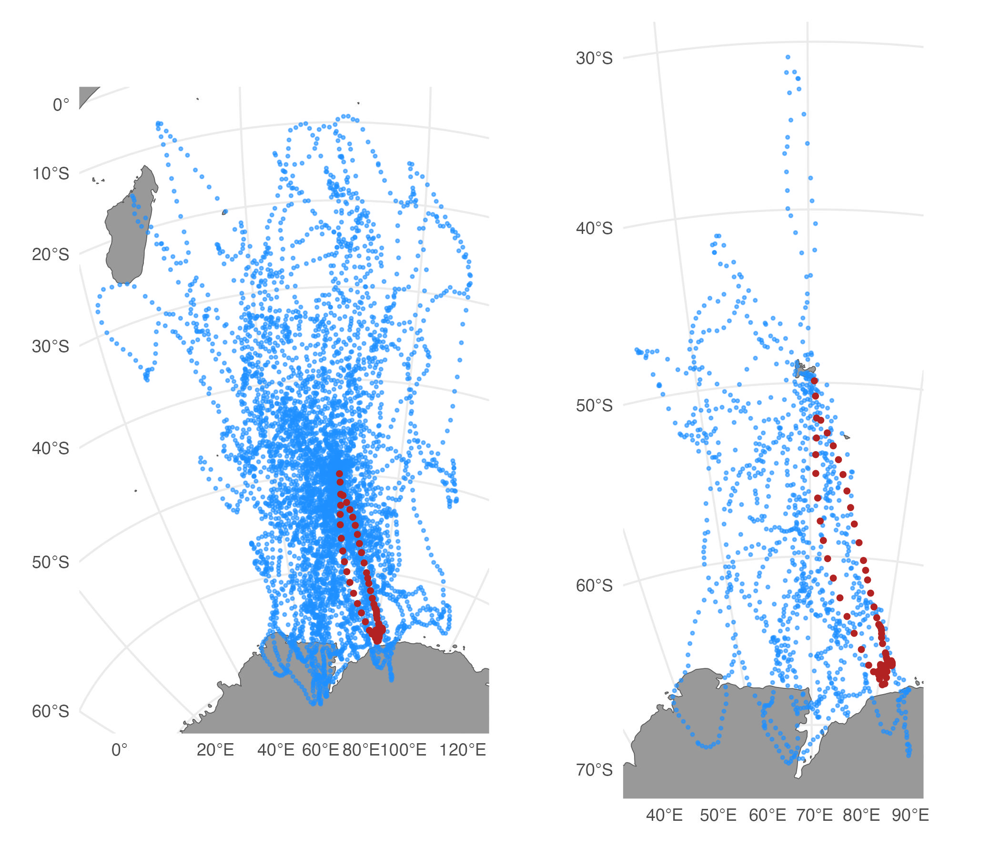
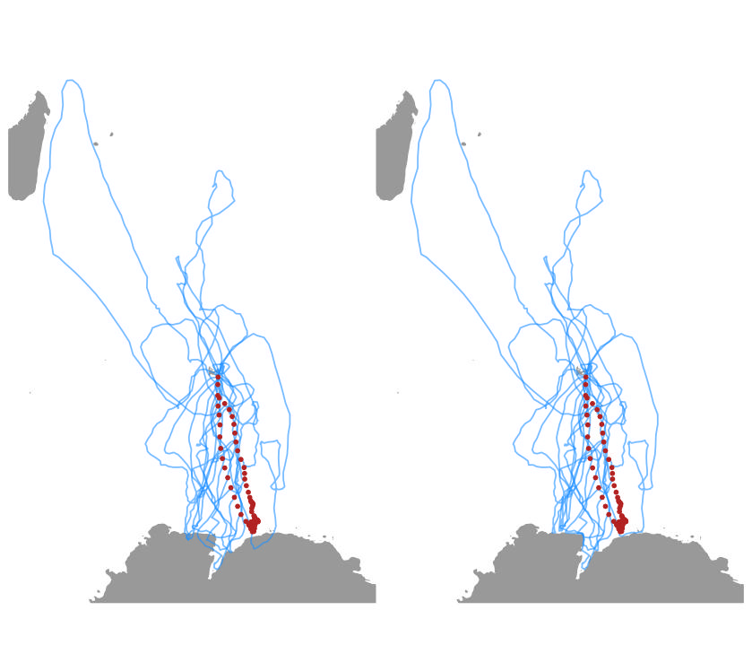

```{r, include = FALSE}
knitr::opts_chunk$set(
  collapse = TRUE,
  comment = "#>"
)
require(foieGras)
require(ggplot2)
require(patchwork)
```
`foieGras` provides 2 track simulation functions for simulating random tracks from a few different movement process models, `sim()`, and for simulating random tracks from fitted SSM models, `simfit()`. 

## `sim()`
The `sim` function is useful for situations where simulated random tracks are required, such as understanding how observed animal tracks deviate from the expectations of the `rw`, `crw` or `mp` movement process models, or for exploring potential bias in SSM fits to data. Tracks can be simulated with regular or random time intervals between locations via the `tdist`, `ts` and `tpar` arguments, and with Argos Least-Squares- or Kalman filter-based location errors via the `error`, `tau` and `rho_o` arguments. Multiple behavioural states with stochastic switching can be implemented for the `rw` and `crw` models via the `alpha` argument.

#### Simulate tracks from each of the 3 process models
```{r sim}
set.seed(pi) 
sim.rw <- sim(N = 200, model = "rw")
sim.crw <- sim(N = 200, model = "crw", D = 0.5)
sim.mp <- sim(N = 200, model = "mp", sigma_g = 0.3)
```

### Plot simulated tracks
```{r plot.sim, fig.width=7, fig.height=6}
(plot(sim.rw, type=2) + labs(title="'rw'") | plot(sim.crw, type=2) + labs(title="'crw'")) / 
  (plot(sim.mp, type = 2) + labs(title="'mp'") | plot(sim.mp, type = 1)) + 
  plot_layout(guides = 'collect') & 
  theme(legend.position = 'bottom')
```

#### Fit SSM to simulated lon,lat locations (with Argos error)
```{r SSM, warning=FALSE, message=FALSE, fig.width=7, fig.height=6}
# coerce simulated RW data to format expected by fit_ssm
d <- with(sim.rw, data.frame(id = 1, date, lc, lon, lat))

# fit SSM `rw` model without any speed filtering
fit.rw <- fit_ssm(d, 
                  spdf = FALSE, 
                  model = "rw", 
                  time.step = 12, 
                  control = ssm_control(verbose = 0))

# fit SSM `crw` model
fit.crw <- fit_ssm(d, 
                   spdf = FALSE, 
                   model = "crw", 
                   time.step = 12, 
                   control = ssm_control(verbose = 0))

# extract SSM fitted locations
loc.rw <- grab(fit.rw, "fitted")
loc.crw <- grab(fit.crw, "fitted")
```

```{r plots, warning=FALSE, message=FALSE, fig.width=7, fig.height=5}
# compare estimated to true values in y-direction
ggplot() +
  geom_point(data = sim.rw, aes(date, I(y+y.err)), col = "grey60") +       # y-values observed with Argos error
  geom_point(data = sim.rw, aes(date, y), col = "dodgerblue") +            # true y-values
  geom_point(data = loc.rw, aes(date, y), cex = 0.7, col = "firebrick") +  # RW SSM fitted y
  geom_point(data = loc.crw, aes(date, y), cex = 0.4, col = "orange")      # CRW SSM fitted y
```

The `rw` (red) and `crw` (orange) SSM's yield similar, reasonable fits to the RW simulated track, although both tend to smooth through some of the natural variability in the simulated true y-values (blue). This reflects a common inability of SSM's to fully separate process and measurement variability in an unbiased manner, especially when measurement error is greater than natural variability (Auger-Méthé et al. 2016).

## `simfit()`
The `simfit` function is rather different, taking a `foieGras` SSM fit object (class `ssm_df`) and simulating replicate tracks by using the movement parameter estimates from the fitted model. Currently, tracks can be simulated from `rw` and `crw` SSM model fits. Tracks can be simulated from either the observation times (`what = "fitted"`) or the prediction times (`what = "predicted"`) and, thus, are constrained to have the same number of locations. The simulated tracks are otherwise unconstrained and should *not* be considered as resampled tracks suitable for exploring uncertainty in the SSM-estimated track. They are useful for habitat usage modelling, to represent habitat that is potentially available to a collection of tracked individuals (e.g., Hindell et al. 2020). 

### Simulate tracks from an SSM fit and plot:
```{r simfit 1, warning=FALSE, message=FALSE, fig.width=7, fig.height=6}
fit <- fit_ssm(sese2, 
               model="crw", 
               time.step=24, 
               control=ssm_control(verbose=0))

st <- simfit(fit[2,], what="predicted", reps=5)

plot(st, zoom=TRUE)
```

In this case, 3 of the 5 replicate tracks (purple) cross onto land in southeast Asia. We can further constrain the tracks to avoid land by adding a potential function (Brillinger et al. 2012) to the simulation that down-weights movements that cross onto land. 

### Simulate tracks with a potential function to help avoid land:
```{r simfit potential fn, eval=FALSE, warning=FALSE, message=FALSE, fig.width=7, fig.height=6}
load(system.file("extdata/grad.rda", package = "foieGras"))

st.pf <- simfit(fit[2, ], what = "predicted", reps=5, grad=grad, beta=c(-350,-350))

plot(st.pf, zoom=TRUE)
```
{width=98%}
Here, we use built in gradient rasters based on distance from ocean and strongly negative beta parameters (for the x and y directions, respectively) to down-weight movements onto land. Custom gradients can be supplied, e.g., for finer-scale tracks or for other kinds of barriers to movement. The strength of the potential function can be varied by altering the magnitude of the beta parameters, although extremely strong values can yield implausible artefacts in the resulting tracks. Note that with `beta = c(-300,-300)`, the tracks do not all entirely avoid crossing land. One track (at upper right, crosses part of Indonesia); narrow penninsulas pose a particular difficulty for this method.

### Simulate central place foraging tracks
The SSM-estimated track in the above example implies a central place foraging strategy, where the southern elephant seal departs from its breeding colony on Iles Kerguelen for an extended period of time and eventually returns. The simulated tracks do not reflect this strategy because the `crw` SSM fitted to the data does not have long-term memory or any other mechanism that could mimic the return portion of the foraging trip. We can, however, constrain the simulated tracks to return to their origin by applying a simple Brownian Bridge using the `cpf` argument:
```{r simfit 4, eval=FALSE, warning=FALSE, message=FALSE, fig.width=7, fig.height=6}
st.cpf <- simfit(fit[2, ], what = "predicted", reps=5, cpf = TRUE)

plot(st.cpf, zoom=TRUE)
```
{width=98%}

Now the simulated tracks better approximate the SSM-estimated track in terms of total space used. The `cpf` argument can be used in conjunction with the potential function, however, care should be taken as their implementations are independent with the potential function applied first. This means tracks that successfully avoid crossing land due to the potential function are not guaranteed to remain so after applying the `cpf` argument.

## `sim_filter()`
When simulating a large number of replicate tracks using `simfit`, some portion of the simulations may reflect unrealistic movement patterns due to the relatively unconstrained nature of the simulation. A simple approach for identifying and removing less realistic simulated tracks is to use a similarity filter (e.g., Hazen et al. 2017). The `sim_filter` function can calculate two related similarity functions, based on a comparison of the geodesic distances and bearings from the start and end locations of the SSM fitted track and each of the simulated tracks. Simulated tracks can be discarded by defining a threshold quantile via the `keep` argument.
```{r sim_filter 1, eval=FALSE, warning=FALSE, message=FALSE, fig.width=7, fig.height=6}
# simulate 50 tracks
st <- simfit(fit[1,], what = "predicted", reps = 50)

# filter, keep only top 20 %
st_f <- sim_filter(st, keep = 0.2)

# compare unfiltered vs. filtered tracks
plot(st) | plot(st_f)
```
{width=98%}

`sim_filter` handles central place foraging tracks automatically by comparing distances and bearings from the start location to the most distant location.  
```{r sim_filter 2, eval=FALSE, warning=FALSE, message=FALSE, fig.width=7, fig.height=6}
# simulate 50 cpf tracks
st.cpf <- simfit(fit[2,], what = "predicted", reps = 50, cpf = TRUE)

# filter, keep only top 20 %
st.cpf_f <- sim_filter(st.cpf, keep = 0.2)

# compare unfiltered vs. filtered tracks
plot(st.cpf) | plot(st.cpf_f)
```
{width=98%}

## `route_path()` 
We can use `route_path()` (see `vignette('Path_rerouting')` for more details) to re-route the few simulated track segments that cross land.  
```{r route_path b, eval=FALSE, warning=FALSE, message=FALSE, fig.width=7, fig.height=6}
# reroute simulated tracks
st.cpf_frr <- route_path(st.cpf_f, centroids = TRUE)

# compare
plot(st.cpf_f, zoom=TRUE) | plot(st.cpf_frr, zoom=TRUE)
```

```{r route_path a, eval=FALSE, echo=FALSE, warning=FALSE, message=FALSE, fig.width=7, fig.height=6}
if(requireNamespace("pathroutr", quietly = TRUE)) {
  # reroute simulated tracks
  st.cpf_frr <- route_path(st.cpf_f, centroids = TRUE)

  # compare
  plot(st.cpf_f, zoom=TRUE) | plot(st.cpf_frr, zoom=TRUE)
} else {
  cat("\n the 'pathroutr' pkg is not installed, use remotes::install_github(\"jmlondon/pathroutr\")
          or install.packages(\"pathroutr\", repos = \"https://jmlondon.r-universe.dev\")to use this function\n")
}
```
{width=98%}

In more severe cases, tracks first could be simulated using potential functions, filtered, and then any remaining segments re-routed from land.

## References
Auger-Méthé M, Field C, Albertsen CM, Derocher AE, Lewis MA, Jonsen ID, Mills Flemming J (2016) State-space models’ dirty little secrets: even simple linear Gaussian models can have estimation problems. Scientific reports. 6(1):1-10. https://www.nature.com/articles/srep26677

Brillinger DR, Preisler HK, Ager AA, Kie J (2012) The use of potential functions in modelling animal movement. In: Guttorp P., Brillinger D. (eds) Selected Works of David Brillinger. Selected Works in Probability and Statistics. Springer, New York. pp. 385-409. https://link.springer.com/chapter/10.1007/978-1-4614-1344-8_22

Hazen et al. (2017) WhaleWatch: a dynamic management tool for predicting blue whale density in the California Current J. Appl. Ecol. 54: 1415-1428 https://besjournals.onlinelibrary.wiley.com/doi/full/10.1111/1365-2664.12820

Hindell MA, Reisinger RR, Ropert-Coudert Y, et al. (2020) Tracking of marine predators to protect Southern Ocean ecosystems. Nature. 580:87–92. https://www.nature.com/articles/s41586-020-2126-y